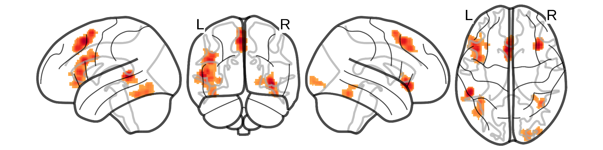

# A meta-analysis of fMRI studies of semantic cognition in children

[](https://opensource.org/licenses/MIT)
[](https://www.python.org/)
[](https://mybinder.org/v2/gh/alexenge/meta_semantics/HEAD)

This repository contains the code, data, and results for the following paper:

*APA style citation for the paper/preprint goes here*

## What you can do here:

### 1. Browse through a static version of the project

By clicking on the respective folder, you can view the data that went into the meta-analysis, the Python code that was used to perform it, and the results in the form of statistical maps, tables, and figures. This may be of interest to get an overall impression of the project but will not allow you to re-run or modify any of the analyses.

### 2. Reproduce the analyses interactively

If you want rerun or modify any of the code, you have three different options.

#### a) On a cloud server using Binder

Simply hit the blue Binder badge at the top or click this [link](https://mybinder.org/v2/gh/alexenge/meta_semantics/HEAD) to open an interactive version of this repository. This will run on a cloud server kindly provided by the [Binder project](https://mybinder.readthedocs.io/en/latest/about/about.html), which means that you do not have to install any software on your local computer. Note, however, that (a) launching the server may take a couple of minutes and (b) the computational resources (CPU cores and memory) on this server are limited.

#### b) In a local container using Docker

If, instead, you want to run the code on your local machine, we suggest you do so using our [Docker container](https://hub.docker.com/repository/docker/alexenge/meta_semantics). This will create a small, Linux-based virtual machine on your local system. It already has all of the right software package versions installed and will (in theory) allow you to exactly reproduce all of our results. To get going, simply download and install the [Docker Desktop software](https://www.docker.com/products/docker-desktop). Once Docker Desktop is running, open a new command line window (called "Terminal" on Mac and Linux and "PowerShell" or "Git Bash" on Windows). Copy, paste, and execute the following one-liner:

```
docker run --rm -p 8888:8888 alexenge/meta_semantics:latest
```

You will get multiple links displayed in your command line window. Simply copy the last one of these and paste it into the search bar of your web browser. From there, you will be able to access, execute, and modify the our Python notebooks interactively.

Note that there is also an open source alternative to the Docker software called [Singularity](https://sylabs.io/singularity/). This may be helpful when you need to run the container on a system where you do not have root user priveleges.

#### c) With your local Python installation

We recommend using one of the two containerized solutions described above because they will ensure that you are executing the code in the exact same software environment which we have also used for our paper. However, you may for some reason prefer to execute the code directly on your local system.

To do so, please follow these three steps:

1. Make sure you have a recent version (> 3.6) of Python installed. You can test this by typing `python3 --version` on the command line. In case you do not yet have a Python installation, we recommend installing it via the [Anaconda](https://www.anaconda.com/products/individual) toolkit.

2. Clone the repository from GitHub, either by (a) [downloading it as a zip file](https://github.com/alexenge/meta_semantics/archive/refs/heads/main.zip) or by (b) opening the command line and typing `git pull git@github.com:alexenge/meta_semantics.git`. Note that the latter requires you to have [git installed](https://git-scm.com/downloads) (which should be the case by default on Mac and Linux).

3. Install the necessary Python packages by opening the command line, navigating into the directory you have just downloaded (e.g., `cd meta_semantics`), and executing the following command: `pip3 install -U -r requirements.txt`

Then you can use your IDE of choice (e.g., the Spyder IDE shipped with Anaconda) to open the Python scripts and rerun the code within your local Python environment.

### 3. Contact us

We are glad to receive any feedback, questions, or criticisms on this project. Simply [open an issue on GitHub](https://github.com/alexenge/meta_semantics/issues/new/choose) or use the corresponding author's e-mail address as provided in the paper.

Thanks a lot for your time and interest.


